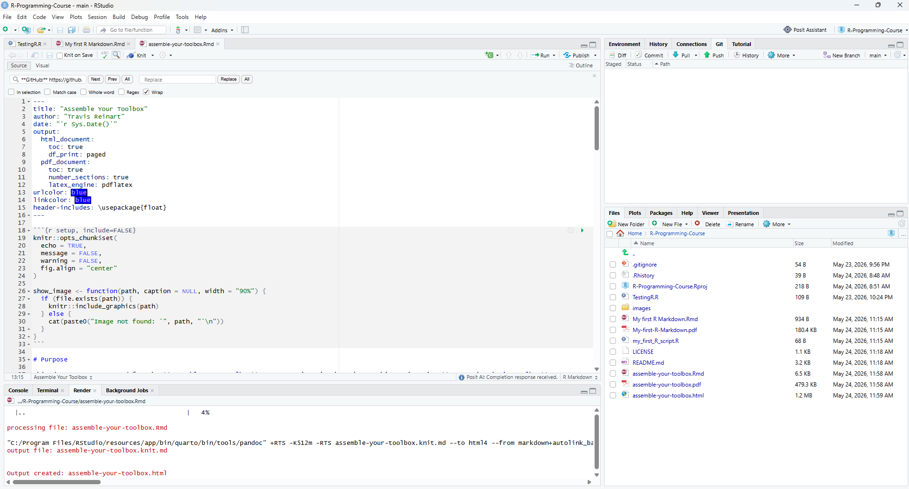
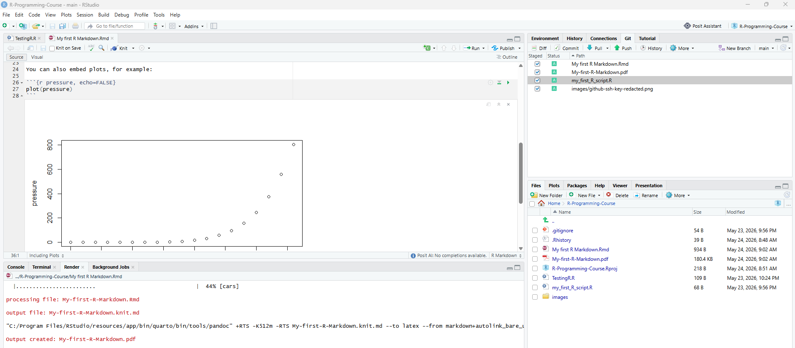
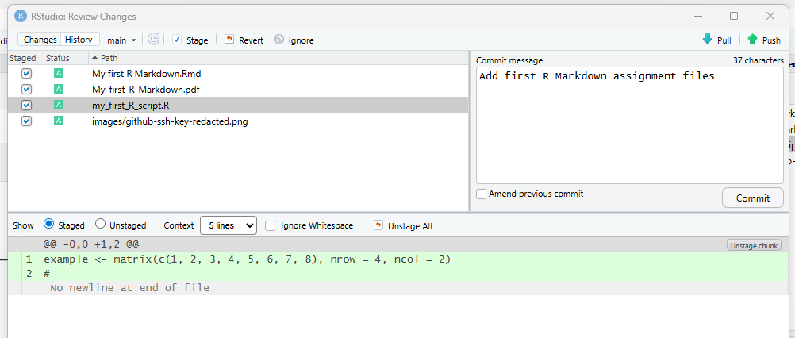
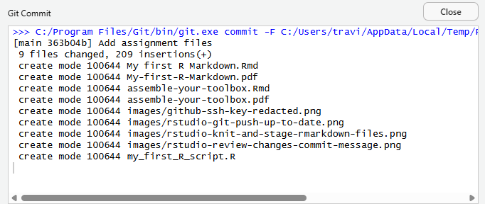
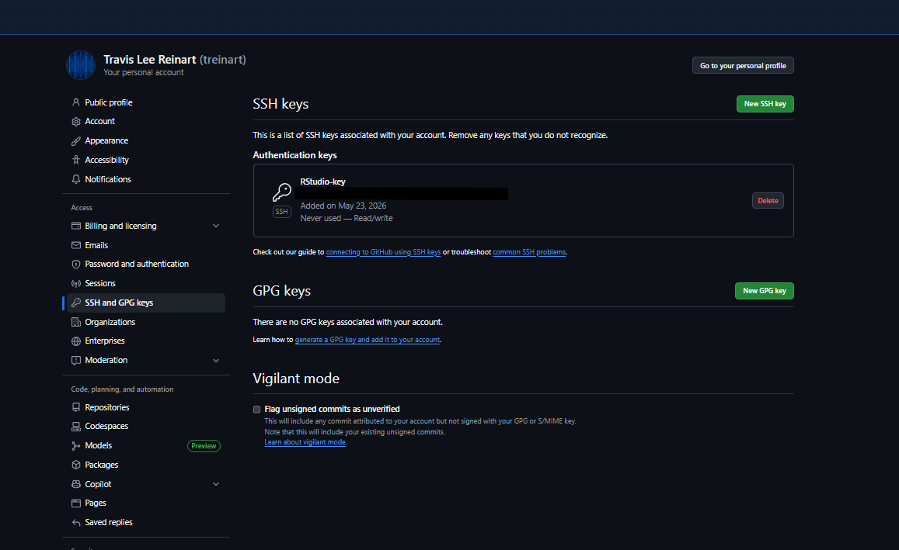
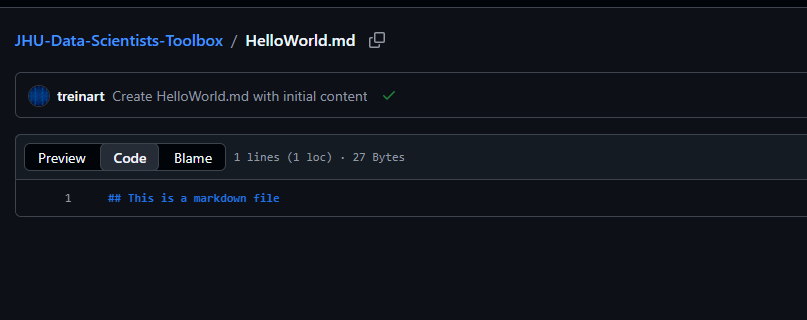
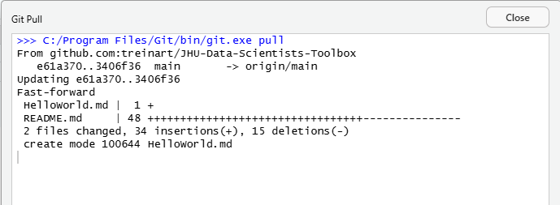
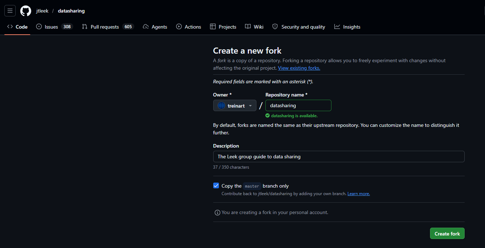
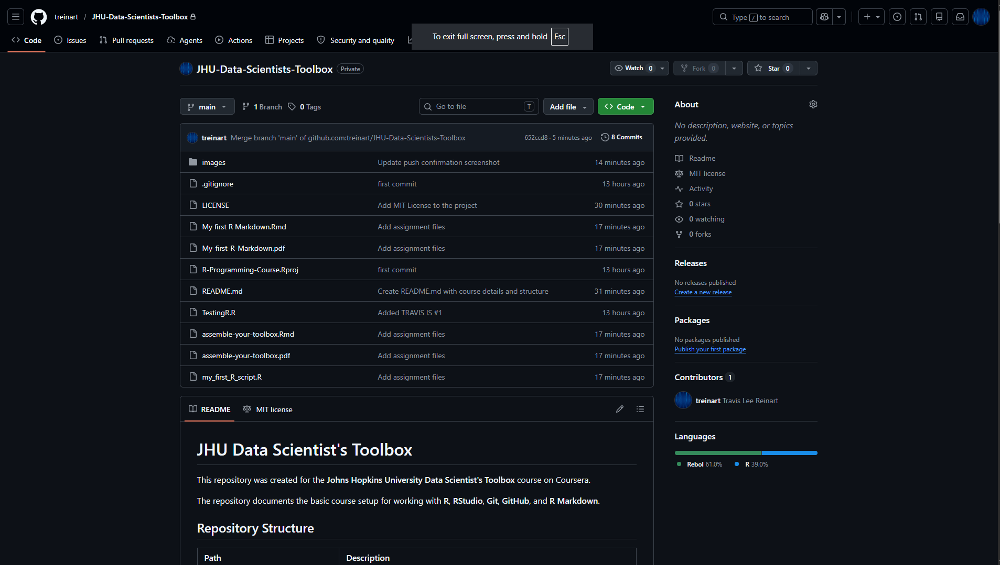

```{r setup, include=FALSE}
knitr::opts_chunk$set(
  echo = TRUE,
  message = FALSE,
  warning = FALSE,
  fig.align = "center"
)

show_image <- function(path, caption = NULL, width = "90%") {
  if (file.exists(path)) {
    knitr::include_graphics(path)
  } else {
    cat(paste0("Image not found: `", path, "`\n"))
  }
}
```

# Purpose

## Assignment Note

Before submitting, I realized the assignment instructions specifically referenced a repository named `datasciencecoursera`. I had already completed the setup work in this repository under the name `JHU-Data-Scientists-Toolbox`, which clearly identifies the course and contains the required setup files, markdown file, screenshots, and GitHub workflow evidence.

The repository name is different, but the required work is documented here and the repository is public and accessible.

This document was created for the **Assemble Your Toolbox** course project in the Johns Hopkins University **Data Scientist's Toolbox** course on Coursera.

The GitHub repository for this project is:

[https://github.com/treinart/JHU-Data-Scientists-Toolbox](https://github.com/treinart/JHU-Data-Scientists-Toolbox)

The direct HTML report is available here:

[https://treinart.github.io/JHU-Data-Scientists-Toolbox/assemble-your-toolbox.html](https://treinart.github.io/JHU-Data-Scientists-Toolbox/assemble-your-toolbox.html)

The required `HelloWorld.md` file is available here:

[https://github.com/treinart/JHU-Data-Scientists-Toolbox/blob/main/HelloWorld.md](https://github.com/treinart/JHU-Data-Scientists-Toolbox/blob/main/HelloWorld.md)

The forked `datasharing` repository is available here:

[https://github.com/treinart/datasharing](https://github.com/treinart/datasharing)

The purpose of this project is to demonstrate that the basic tools used in the Data Science Specialization have been installed, configured, and connected successfully.

The tools and course setup items demonstrated in this project are:

- R
- RStudio
- Git
- GitHub
- R Markdown
- CRAN packages
- Bioconductor packages
- GitHub Pages HTML publishing
- `HelloWorld.md`
- Forking a GitHub repository

# R and RStudio Setup

R and RStudio were installed locally and used to create this project. The project was managed through an RStudio Project folder and connected to GitHub using Git version control.

The local R version and working directory are shown below.

```{r r-version-and-directory}
R.version.string
getwd()
```

# Package Setup

The following packages were installed during the course setup activities. The table below confirms that each package is available in my local R library.

```{r package-check}
course_packages <- c(
  "ggplot2",
  "devtools",
  "lme4",
  "BiocManager",
  "GenomicFeatures",
  "rmarkdown",
  "knitr"
)

package_check <- data.frame(
  Package = course_packages,
  Installed = course_packages %in% rownames(installed.packages())
)

package_check
```

The packages below are loaded to confirm that the installed R environment can run course-related package commands successfully.

```{r load-course-packages}
library(ggplot2)
library(lme4)
library(BiocManager)
library(GenomicFeatures)

cat("Course package check completed successfully.")
```

# R Markdown Demonstration

R Markdown combines regular written explanation, R code, and code output in one reproducible document. This file was created in RStudio and knitted into a rendered output document.

The simple R code below confirms that code chunks run inside the R Markdown document.

```{r simple-r-example}
x <- c(1, 2, 3, 4, 5)
mean(x)
```

The plot below confirms that R Markdown can also include R-generated visual output.

```{r rmarkdown-plot-demo, message=FALSE, warning=FALSE, fig.width=7, fig.height=4.5}
library(ggplot2)

ggplot(mtcars, aes(x = wt, y = mpg)) +
  geom_point(size = 3, alpha = 0.8) +
  geom_smooth(method = "lm", se = FALSE, linewidth = 1) +
  labs(
    title = "Vehicle Weight vs. Fuel Efficiency",
    subtitle = "Example R-generated plot rendered inside R Markdown",
    x = "Vehicle Weight",
    y = "Miles Per Gallon"
  ) +
  theme_minimal(base_size = 12)
```

# Git and GitHub Setup

Git was used for local version control, and GitHub was used as the remote repository.

The workflow demonstrated in this project was:

1. Create and edit files in RStudio.
2. Stage files using Git.
3. Commit changes locally with a descriptive message.
4. Push committed changes to GitHub.
5. Create the required `HelloWorld.md` file.
6. Pull GitHub changes back into the local RStudio project.
7. Fork the required `jtleek/datasharing` repository.
8. Publish the rendered HTML report through GitHub Pages.
9. Confirm that the final files appear in the GitHub repository.

The GitHub repository for this project is:

[https://github.com/treinart/JHU-Data-Scientists-Toolbox](https://github.com/treinart/JHU-Data-Scientists-Toolbox)

The direct HTML report is available here:

[https://treinart.github.io/JHU-Data-Scientists-Toolbox/assemble-your-toolbox.html](https://treinart.github.io/JHU-Data-Scientists-Toolbox/assemble-your-toolbox.html)

The required `HelloWorld.md` file is available here:

[https://github.com/treinart/JHU-Data-Scientists-Toolbox/blob/main/HelloWorld.md](https://github.com/treinart/JHU-Data-Scientists-Toolbox/blob/main/HelloWorld.md)

The forked `datasharing` repository is available here:

[https://github.com/treinart/datasharing](https://github.com/treinart/datasharing)

# Setup Evidence

The screenshots below document the setup and version control workflow. The screenshots are stored in the `images/` folder of this repository and included here as supporting evidence.

## RStudio Installation

This screenshot shows RStudio open locally after installation.

```{r evidence-rstudio-installed, echo=FALSE, out.width="95%", fig.align="center", fig.cap="RStudio open on the local machine.", fig.pos="H"}

```

## RStudio Git Staging

This screenshot shows the RStudio Git pane with project files prepared for commit.

```{r evidence-staging, echo=FALSE, out.width="95%", fig.align="center", fig.cap="RStudio Git pane showing staged project files.", fig.pos="H"}

```

## RStudio Review Changes and Commit Message

This screenshot shows the RStudio review window and the commit message used for the project files.

```{r evidence-review-commit, echo=FALSE, out.width="95%", fig.align="center", fig.cap="RStudio Review Changes window with commit message.", fig.pos="H"}

```

## Git Push Confirmation

This screenshot shows the Git push confirmation from RStudio.

```{r evidence-git-push, echo=FALSE, out.width="95%", fig.align="center", fig.cap="RStudio Git push confirmation.", fig.pos="H"}

```

## GitHub SSH Key Setup

This screenshot shows the GitHub SSH key setup page with sensitive details redacted.

```{r evidence-ssh-key, echo=FALSE, out.width="85%", fig.align="center", fig.cap="Redacted GitHub SSH key setup evidence.", fig.pos="H"}

```

## HelloWorld Markdown File

This screenshot shows the required `HelloWorld.md` file created in GitHub with the line `## This is a markdown file`.

```{r evidence-helloworld, echo=FALSE, out.width="95%", fig.align="center", fig.cap="HelloWorld.md file created in the GitHub repository.", fig.pos="H"}

```

This screenshot shows the `HelloWorld.md` file being pulled from GitHub back into the local RStudio project folder.

```{r evidence-helloworld-pull, echo=FALSE, out.width="95%", fig.align="center", fig.cap="Git pull in RStudio after creating HelloWorld.md on GitHub.", fig.pos="H"}

```

## Forked Data Sharing Repository

The assignment also required forking the `jtleek/datasharing` repository. The forked repository is available here:

[https://github.com/treinart/datasharing](https://github.com/treinart/datasharing)

This screenshot shows the forked repository under my GitHub account.

```{r evidence-datasharing-fork, echo=FALSE, out.width="95%", fig.align="center", fig.cap="Forked datasharing repository under my GitHub account.", fig.pos="H"}

```

## GitHub Repository After Push

This screenshot shows the GitHub repository after the project files were pushed.

```{r evidence-github-repo, echo=FALSE, out.width="95%", fig.align="center", fig.cap="GitHub repository homepage after files were pushed.", fig.pos="H"}

```

# Conclusion

This project demonstrates that the required course toolbox has been assembled. R and RStudio are installed locally, course-related R packages are available, R Markdown can be created and rendered, and Git is tracking the local RStudio project.

The GitHub workflow is also demonstrated through staging, committing, pushing, pulling, creating the required `HelloWorld.md` file, and forking the required `jtleek/datasharing` repository.

The final repository includes the source R Markdown file, rendered PDF, rendered HTML report, setup screenshots, the required `HelloWorld.md` file, and links to both the project repository and the forked data sharing repository.

This setup provides a working foundation for the rest of the Johns Hopkins Data Science Specialization.
